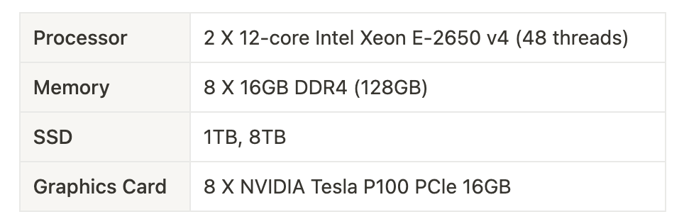
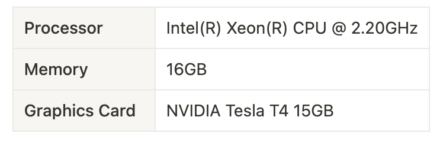
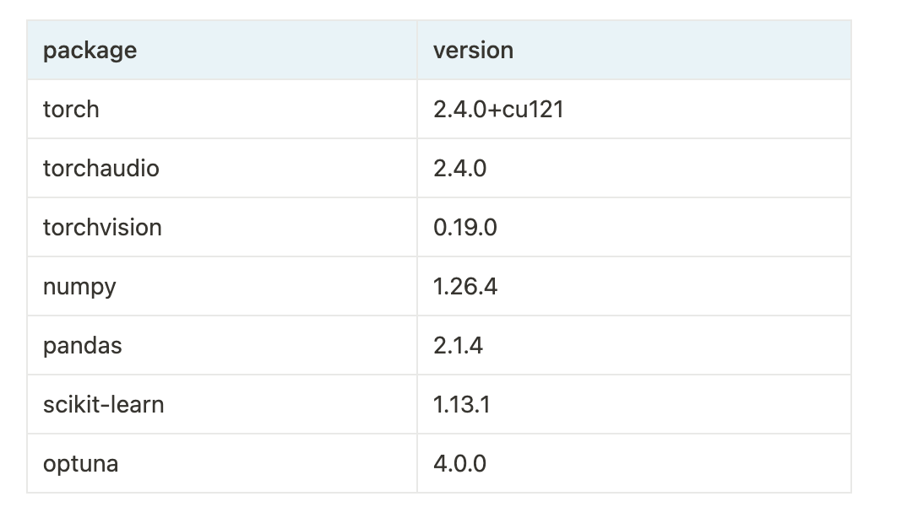

# deepuav

> 2024 충남대학교 컴퓨터융합학부 창의작품경진대회
SwiftTurtles 팀의 개발 결과물 저장소입니다.

무인 비행체 경로 예측 딥러닝 모델 구축을 주제로, LSTM, GRU, Transformer 모델을 개발하였습니다.

## 데이터셋 소개
취리히 대학 Robotics and Perception Group 의 [The Zurich Urban Micro Aerial Vehicle Dataset](https://rpg.ifi.uzh.ch/zurichmavdataset.html) 을 사용하였습니다.
- 낮은 고도(지상 5-15m)에서 취리히 도심을 비행하는 초소형 항공기(MAV)가 수집한 이미지와 GPS, IMU 센서 데이터 등을 포함합니다.
- MAV 의 비행 거리는 약 2km 이며, 시간 동기화되어 약 34 밀리초 간격으로 GPS 좌표를 제공합니다.

> A.L. Majdik, C. Till, D. Scaramuzza, The Zurich Urban Micro Aerial Vehicle Dataset   
International Journal of Robotics Research, April 2017

## 개발 환경
코랩 클라우드 환경에서 모델 설계 및 하이퍼파라미터 탐색 후 GPU 서버에서 학습 및 예측을 수행하였습니다.

#### GPU 서버


#### 코랩 클라우드 환경


#### 라이브러리 (`requirements.txt`)


## 연구 내용
1. LSTM, GRU, Transformer 각 모델에 Optuna 도구를 사용해 하이퍼파라미터 튜닝 과정을 거칩니다.
2. 동일한 에포크에서 성능이 가장 좋았던 Transformer 모델을 활용해 validation loss 가 최소가 되는 에포크를 탐색합니다.
3. 찾은 에포크로 하이퍼파라미터 튜닝을 다시 수행합니다.
4. 선정한 모델과 하이퍼파라미터로 학습에 몇 개의 데이터를 사용할 것인지(Lookback)를 비교, 결정합니다.
5. 결정한 lookback 으로 예측할 시점(Forward)을 여러 개 설정하여 성능을 비교합니다.

## 개발 결과물
```text
.
├── README.md
├── forward
│   ├── 3
│   ├── 5
│   ├── 7
│   └── best_hyperparameters.json
├── images
├── lookback
│   ├── 10
│   ├── 30
│   ├── 50
│   └── best_hyperparameters.json
├── model_comparison
│   ├── gru
│   │   ├── best_hyperparameters_gru.json
│   │   ├── deepuav_gru.ipynb
│   │   └── models
│   ├── lstm
│   │   ├── best_hyperparameters.json
│   │   ├── deepuav_lstm.ipynb
│   │   └── models
│   └── transformer
│       ├── best_hyperparameters.json
│       ├── deepuav_transformer.ipynb
│       └── models
└── requirements.txt
```

#### model_comparison
LSTM, GRU, Transformer 세 개의 모델 개발 코드와 하이퍼파라미터 튜닝을 거친 파라미터 파일, 학습 모델 파일을 포함합니다.

#### lookback
Transformer 에서 validation loss 가 가장 낮았던 632 epoch 로 하이퍼파라미터 튜닝을 거친 파라미터 파일과 10, 30, 50 개의 학습 데이터를 사용한 코드와 모델 파일을 포함합니다.

#### forward
Transformer 에서 validation loss 가 가장 낮았던 632 epoch 로 하이퍼파라미터 튜닝을 거친 파라미터 파일과 lookback 30 으로 1.5초(3), 2.5초(5), 3.5초(7) 뒤를 예측한 코드와 모델 파일을 포함합니다.