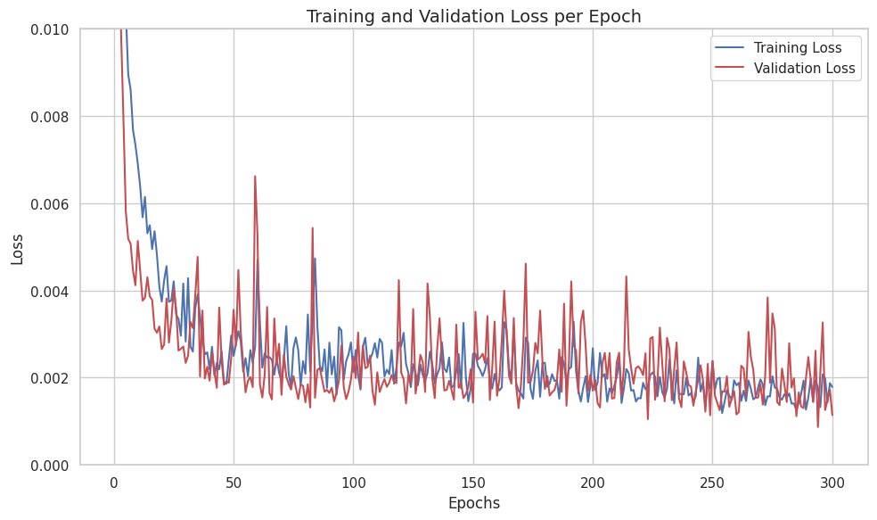
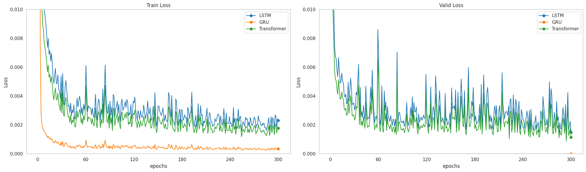

## DeepUav - Transformer    
    
### 💡Flow 
1. 데이터 셋 가져오기 
2. 데이터 셋 전처리    
    - 데이터셋 보간 "interp1d"  
    - 소수점 절사    
    - MinMaxScaling 적용
    - train/validation/test 분리 (6:2:2)
    - 시퀀스 생성    
        - look back = 10   
        - forward = 0   
3. 최적의 하이퍼 파라미터 탐색 
    Optuna 사용  
    "Epoch = 300"    
    "n_trials = 100"
4. 최적의 파라미터로 모델 학습    
    "Epoch = 300"
5. 그래프 

### Transformer Model
FC Linear + PositionalEncoding + TransformerEncoding + FC Linear    

### 📈 Graph 📉

